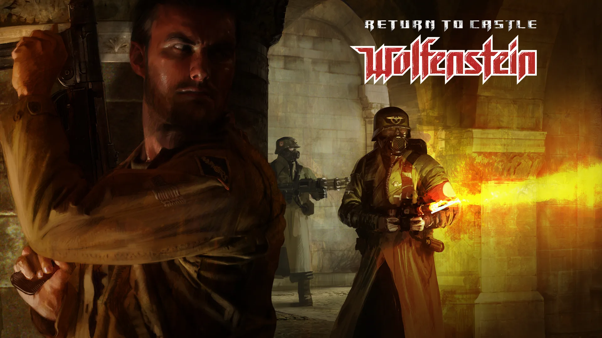
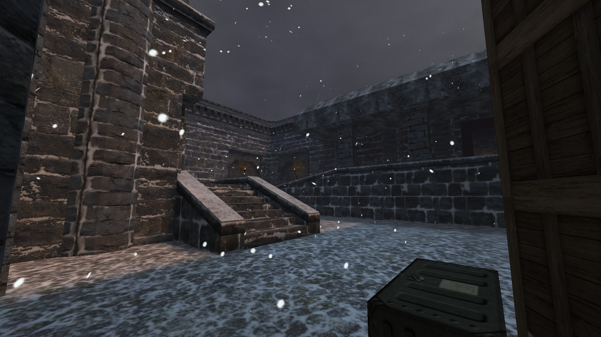
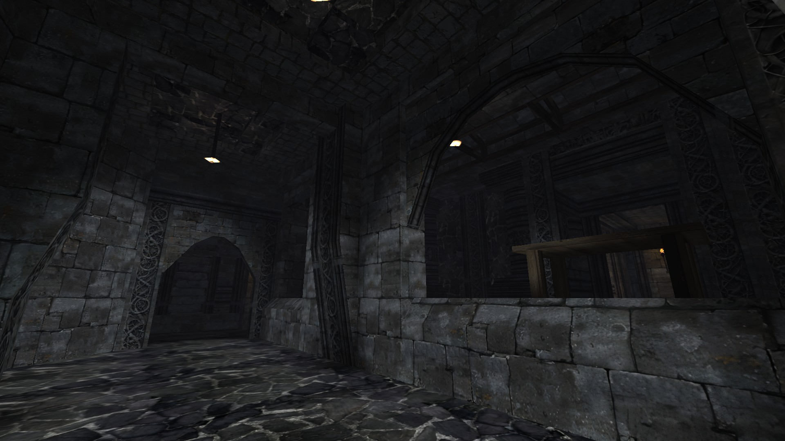
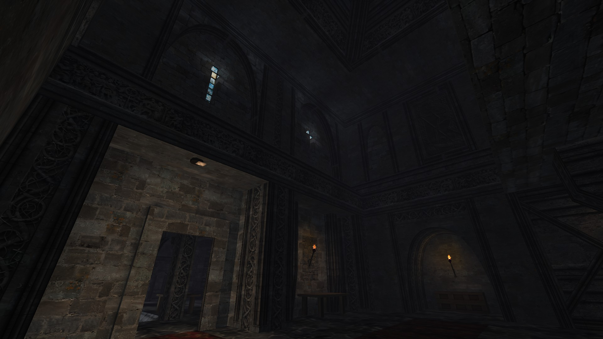
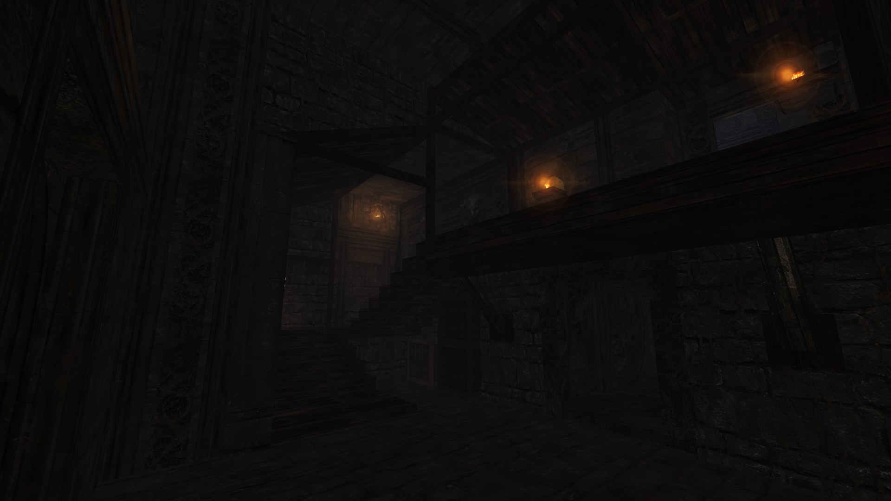
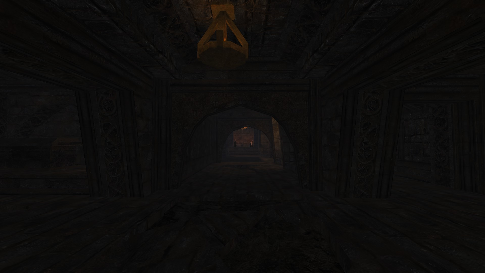

# Return To Castle Ear1hstein
# Status: ✅RELEASED

**Return To Castle Ear1hstein** is a single level for **RealRTCW mod**

### Download - [Latest Release](https://github.com/Ear1h/Return-To-Castle-Ear1hstein/releases/download/v1/earthcastle.pk3)

# **How to launch**
1. Download RTCW, RealRTCW on steam.
2. Copy earthcastle.pk3 to:_ Documents/RealRTCW/5.1/main/_
3. Launch **RealRTCW**
4. Open console **`** and write _/spdevmap earthcastle_
5. Done
       
# **Lore:**
You have been sent to one of the classified castles in Germany, where they are conducting archaeological excavations inside underground
citadels. Unfortunately, there is very little informationabout the citadels. The only thing we know about it
is that legend has it that it was built not by man, but by the devil.
                          
To fight the evil, you are warned that there is a shotgun nearby that can crush anyone who gets in your way, but the specific location is unknown.

# **Special Thanks:**
* Broy
* DRON12261
* Shiroi Akuma
* Track Federal

# **SCREENSHOTS:**

